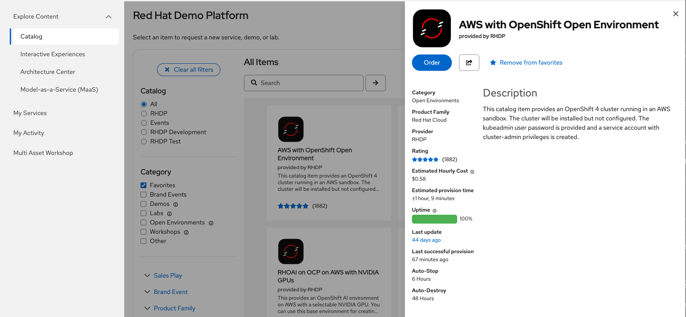
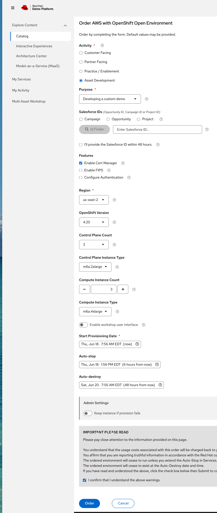
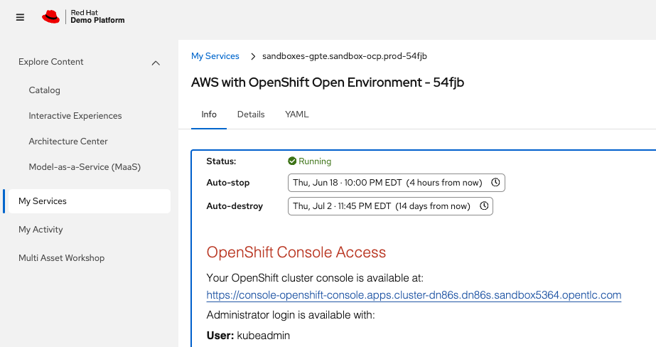

# Provision a Cluster (demo.redhat.com)

This guide creates a fresh OpenShift cluster on the Red Hat Demo Platform and
logs you in with `oc`, ready for the [install](install-make.md).

If you already have an OpenShift 4.20+ cluster and `oc` access, skip to
[Log in with `oc`](#3-log-in-with-oc).

## Before you start

You need:

- A **Red Hat SSO account** with access to [demo.redhat.com](https://catalog.demo.redhat.com/)
  (Red Hat associates and partners).
- The **`oc` CLI** — download from the
  [OpenShift mirror](https://mirror.openshift.com/pub/openshift-v4/clients/ocp/stable/)
  or, after the cluster is up, from the web console's **? → Command line tools**.
- **`git`** and **GitHub access** to clone this repository.
- **Registry credentials — one of these is required** (the install can't pull RHOAI
  images without them):
  - **quay.io credentials** with `quay.io/rhoai` access (manual mode), **or**
  - **read access to the private
    [bootstrap repo](https://github.com/rh-aiservices-bu/rh-aiservices-bu-bootstrap)**
    (External Secrets mode). If you don't have quay access, **request read access to
    that repo before you start** — it's private, so you must be granted access first.

  See [Configuration → Pull-secret credentials](configuration.md#pull-secret-credentials).

## 1. Order an AWS OpenShift environment

Open **[AWS with OpenShift Open Environment](https://catalog.demo.redhat.com/catalog/babylon-catalog-prod?item=babylon-catalog-prod/sandboxes-gpte.sandbox-ocp.prod)**
directly, or find it in the [demo.redhat.com catalog](https://catalog.demo.redhat.com/).



> This catalog item provisions a bare OpenShift 4 cluster in an AWS sandbox. The
> cluster is **installed but not configured** — exactly what this repo configures.
> It provides the `kubeadmin` password and a cluster-admin service account.

Click **Order** and fill in the request form:



Recommended settings:

| Field | Recommendation |
|-------|----------------|
| **Activity / Purpose** | Whatever matches your use (e.g. Practice / Enablement) |
| **OpenShift Version** | 4.20 or newer |
| **Control Plane Count** | **3** |
| **Control Plane Instance Type** | **`m6a.2xlarge`** — required if you plan to run MaaS observability (the monitoring cascade is memory-heavy on the masters; smaller types fail the settle-gate). Set it here at order time — you can't resize masters later. |
| **Compute Instance Count** | **3** (the install adds GPU/CPU MachineSets on top) |
| **Compute Instance Type** | Default is fine — GPU/CPU worker nodes are created later by `make gpu` / `make cpu` |
| **Region** | A region with `g6e` GPU capacity (e.g. **us-east-2**) if you want GPU models |

Set the **Auto-stop** and **Auto-destroy** timers to suit your needs — the cluster
stops after a few hours of inactivity and is destroyed after the auto-destroy date
(up to ~2 weeks). You can extend or restart it later from **My Services**.

## 2. Wait for provisioning and collect credentials

Provisioning takes roughly **30–70 minutes**. When it finishes you'll get an email,
and the **My Services** entry shows `Status: Running` with the cluster's access details:



From this page collect:

- The **console URL** (`https://console-openshift-console.apps.<cluster>...`)
- The **API server URL** (`https://api.<cluster>:6443`)
- The **`kubeadmin`** username and password (under *OpenShift Console Access*)
- An **`oc login` command** with a token (sometimes provided directly)

## 3. Log in with `oc`

Use the login command from the service details. Either a token:

```bash
oc login --token=<token> --server=https://api.<cluster>:6443
```

…or `kubeadmin` credentials:

```bash
oc login -u kubeadmin -p <password> https://api.<cluster>:6443
```

Verify you're connected as a cluster-admin:

```bash
oc whoami
oc whoami --show-server
oc get nodes
```

You should see the control-plane and compute nodes in `Ready` state.

## 4. Clone this repository

```bash
git clone https://github.com/rh-aiservices-bu/rhoai-nightly.git
cd rhoai-nightly
```

## Next steps

- Check readiness: `make preflight`
- **[Install with make](install-make.md)** — the standard path
- **[Install with Claude](install-claude.md)** — drive the same install from Claude Code
